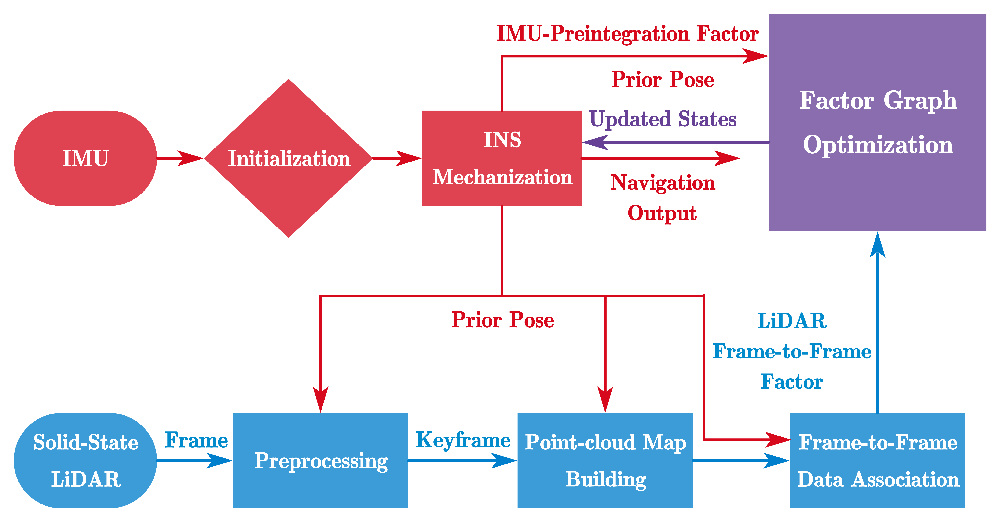

# FF-LINS

## A Consistent Frame-to-Frame Solid-State-LiDAR-Inertial State Estimator

Most of the existing LiDAR-inertial navigation systems are based on frame-to-map registrations, leading to inconsistency in state estimation. The newest solid-state LiDAR with a non-repetitive scanning pattern makes it possible to achieve a consistent LiDAR-inertial estimator by employing a frame-to-frame data association. Hence, we propose a Consistent frame-to-frame LiDAR-inertial navigation system (FF-LINS) for solid-state LiDARs. With the INS-centric LiDAR frame processing, the keyframe point-cloud map is built using the accumulated point clouds to construct the frame-to-frame data association. The LiDAR frame-to-frame and the inertial measurement unit (IMU) preintegration measurements are tightly integrated using the factor graph optimization, with online calibration of the LiDAR-IMU extrinsic and time-delay parameters. The experiments on the public and private datasets demonstrate that the proposed FF-LINS achieves superior accuracy and robustness than the state-of-the-art systems. Besides, the LiDAR-IMU extrinsic and time-delay parameters are estimated effectively, and the online calibration notably improves the pose accuracy.



**Authors:** Hailiang Tang, Xiaoji Niu, and Tisheng Zhang from the [Integrated and Intelligent Navigation (i2Nav) Group](http://www.i2nav.com/), Wuhan University.

**Related Paper:**

- Hailiang Tang, Tisheng Zhang, Xiaoji Niu, Liqiang Wang, Linfu Wei, and Jingnan Liu, “FF-LINS: A Consistent Frame-to-Frame Solid-State-LiDAR-Inertial State Estimator,” *IEEE Robotics and Automation Letters*, 2023.
- Hailiang Tang, Tisheng Zhang, Xiaoji Niu, Liqiang Wang, and Jingnan Liu, "LE-VINS: A Robust Solid-State-LiDAR-Enhanced Visual-Inertial Navigation System for Low-Speed Robots," *IEEE Transactions on Instrumentation and Measurement*, 2023.
- Xiaoji Niu, Hailiang Tang, Tisheng Zhang, Jing Fan, and Jingnan Liu, “IC-GVINS: A Robust, Real-time, INS-Centric GNSS-Visual-Inertial Navigation System,” *IEEE Robotics and Automation Letters*, 2023.
- Hailiang Tang, Tisheng Zhang, Xiaoji Niu, Jing Fan, and Jingnan Liu, “Impact of the Earth Rotation Compensation on MEMS-IMU Preintegration of Factor Graph Optimization,” *IEEE Sensors Journal*, 2022.

**Contacts:**

- For any technique problem, you can send an email to Dr. Hailiang Tang (thl@whu.edu.cn).
- For Chinese users, we also provide a QQ group (481173293) for discussion. You are required to provide your organization and name.

## 1 Prerequisites

### 1.1 System and compiler

We recommend you use Ubuntu 18.04 or Ubuntu 20.04 with the newest compiler (**gcc>=8.0 or clang>=6.0**).

```shell
# gcc-8
sudo apt install gcc-8 g++-8

# Clang
# sudo apt install clang
```

### 1.2 Robot Operating System (ROS)

Follow [ROS Melodic installation instructions for Ubuntu 18.04](https://wiki.ros.org/melodic/Installation/Ubuntu) and [ROS Noetic installation instructions for Ubuntu 20.04](http://wiki.ros.org/noetic/Installation/Ubuntu).

### 1.3 oneTBB

Threading Building Blocks (TBB) are used for parallel point clouds processing. We recommend you use [oneTBB](https://github.com/oneapi-src/oneTBB), and install the latest released version. You should install oneTBB before Ceres Solver.

### 1.4 Ceres Solver with its Dependencies

We use **Ceres Solver (>=2.1.0)** to solve the non-linear least squares problem in FF-LINS. Please follow [Ceres installation instructions](http://ceres-solver.org/installation.html).

The dependencies **Eigen (>=3.3.7)**, **TBB**, **glog (>=0.4.0)** are also used in FF-LINS. You can install them as follows:

```shell
sudo apt install libeigen3-dev libgoogle-glog-dev libtbb-dev
```

If the version cannot be satisfied in your system repository, you should build them from the source code.

### 1.5 yaml-cpp

The yaml-cpp is employed for reading configurations. It can be installed as:

```shell
sudo apt install libyaml-cpp-dev
```

## 2 Build and run FF-LINS

### 2.1 Build the source code

```shell
# Make workspace directory
mkdir ~/lins_ws && cd ~/lins_ws
mkdir src && cd src

# Clone the repository into src directory
git clone https://github.com/i2Nav-WHU/FF-LINS.git

# To lins_ws directory
cd ..

# Build the source code using catkin_make
catkin_make -j8 -DCMAKE_BUILD_TYPE=Release -DCMAKE_C_COMPILER=gcc-8 -DCMAKE_CXX_COMPILER=g++-8
```

### 2.2 Run demo dataset

If you have already downloaded the open-sourced dataset, run the following commands.

```shell
# Open a terminal and source the workspace environments
# For bash
source ~/lins_ws/devel/setup.bash
# For zsh
# source ~/lins_ws/devel/setup.zsh

# Run FF-LINS node
# 1. Download the dataset.
# 2. Change the outputpath in ff_lins_robot.yaml.
# 3. Change the path in the follwoing command.
# 4. Run the follwoing command.
roslaunch ff_lins ff_lins_read.launch configfile:=path/ff_lins_robot.yaml bagfile:=path/park/park.bag 
```

## 3 Datasets

### 3.1 Format

The employed messages in FF-LINS are as follows:

| Sensor            | Message                                                                  | Default Topic |
| ----------------- | ------------------------------------------------------------------------ | ------------- |
| Solid-State LiDAR | [livox_ros_driver/CustomMsg](https://github.com/Livox-SDK/livox_ros_driver) | /livox/lidar  |
| IMU               | [sensor_msgs/Imu](http://docs.ros.org/en/api/sensor_msgs/html/msg/Imu.html) | /livox/imu    |

The IMU should be in the **front-right-down** format in FF-LINS.

### 3.2 LiLi-OM KA-Urban Dataset

| Sequence      | Time length (seconds) | Trajectory Length (km) | Baidu Cloud Link                                                       |
| ------------- | --------------------- | ---------------------- | ---------------------------------------------------------------------- |
| *Schloss-1* | 634                   | 0.67                   | [Schloss-1.bag](https://pan.baidu.com/s/1S_B3c3n4EZ7VGsd8iXlLPw?pwd=7263) |
| *Schloss-2* | 736                   | 1.11                   | [Schloss-2.bag](https://pan.baidu.com/s/1vhgQLtA6iLx5y23GA1V_kg?pwd=peqv) |
| *East*      | 1251                  | 3.64                   | [East.bag](https://pan.baidu.com/s/1XkySrd_fOGTAV6CzLGourQ?pwd=ip3a)      |

### 3.3 R3LIVE Campus Dataset

| Sequence              | Time length (seconds) | Trajectory Length (km) | Baidu Cloud Link                                                               |
| --------------------- | --------------------- | ---------------------- | ------------------------------------------------------------------------------ |
| *hku_main_building* | 1160                  | 0.97                   | [hku_main_building.bag](https://pan.baidu.com/s/1ltElsmKZop-0OYnwEG8Z0w?pwd=4gtc) |
| *hkust_campus_00*   | 1060                  | 1.33                   | [hkust_campus_00.bag](https://pan.baidu.com/s/1QjJbVRcQMvEpKN7j_z5gaQ?pwd=922q)   |
| *hkust_campus_01*   | 1149                  | 1.46                   | [hkust_campus_01.bag](https://pan.baidu.com/s/1GoXZfV9PzPF92hIUyYfvGQ?pwd=162b)   |

### 3.4 FF-LINS Robot Dataset

We also open source our self-collected robot dataset.

| Sequence | Time length (seconds) | Trajectory Length (km) | Baidu Cloud Link                                                  |
| -------- | --------------------- | ---------------------- | ----------------------------------------------------------------- |
| park     | 1326                  | 1.46                   | [park.bag](https://pan.baidu.com/s/1Zm1WyI7hYx7J5ewi7cf_-g?pwd=5k5n) |

### 3.5 Your own dataset

You can run FF-LINS with your self-collected dataset. Keep in mind the following notes:

1. You should prepare the Solid-State LiDAR and the IMU data in a ROS bag;
2. The IMU data should be in the front-right-down format;
3. Modify the topic names in the ff_lins_read.launch or the ff_lins_play.launch file;
4. Modify the parameters in the configuration file.

### 3.6 Evaluation

We use [evo](https://github.com/MichaelGrupp/evo) to evaluate the TUM trajectory files. We also provide some useful scripts ([evaluate_odometry](https://github.com/i2Nav-WHU/evaluate_odometry)) for evaluation.

## 4 Acknowledgements

We thanks the following projects for the helps in developing and evaluating the FF-LINS:

* [IC-GVINS](https://github.com/i2Nav-WHU/IC-GVINS): A Robust, Real-time, INS-Centric GNSS-Visual-Inertial Navigation System
* [OB_GINS](https://github.com/i2Nav-WHU/OB_GINS): An Optimization-Based GNSS/INS Integrated Navigation System
* [evo](https://github.com/MichaelGrupp/evo): Python package for the evaluation of odometry and SLAM

## 5 License

The source code is released under GPLv3 license.

We are still working on improving the codes. For any technical issues, please contact Dr. Hailiang Tang ([thl@whu.edu.cn](mailto:thl@whu.edu.cn)) or open an issue at this repository.

For commercial usage, please contact Prof. Xiaoji Niu ([xjniu@whu.edu.cn](mailto:xjniu@whu.edu.cn)).
